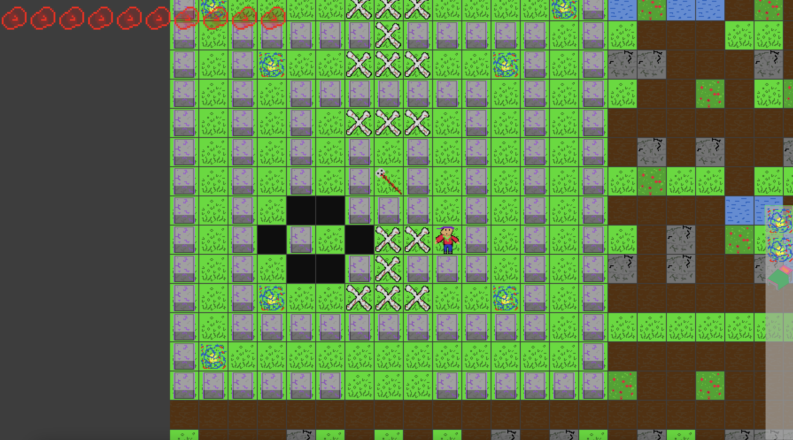

Lifecraft: Sandbox Game based on Conway's Game of Life
===

*A Game made within a week in 8th grade, as the final project of the [CTY](https://cty.jhu.edu/) Summer Program in 2017*
*Just found on my ancient Dropbox account*

Most images were all drawn by me, using [Fire Alpaca](https://www.firealpaca.com/), since there's no MSPaint on a Mac; one of them I found on the internet, and I can't remember where it came from after all these years. The music was all made by myself (terrible quality, I know).

## How to Play

WASD to move, v to collect items, c to use items, and space to sleep.

The goal of the game is to survive as long as possible. Black cells will cause damage while white ones will cure.

*PS: Hard to believe I made this when I was only 14 years old...*

## How to build

Just use Eclipse, and run the `Lifecraft.java` file. This game is written in native Java without any dependency. The code quality is terrible... I was a beginner at Java back then.
